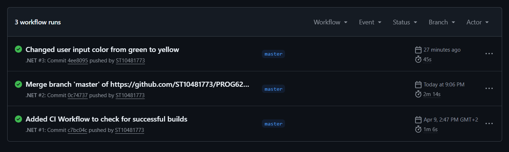

# POE Part 1
Name: Tiyiselani Mogano

Student No: ST10481773

Module: PROG6221

Course: DISD0601

Year: 2

Group: 2
## Installation
Download the latest release in [GitHub releases](https://github.com/ST10481773/PROG6221-POE/releases), then extract the folder and run the executable.
## Build
Requirements:
- Visual Studio (community version 2022 or later)
- NET 9.0

Clone the repository, then open the .slnx folder in Visual Studio, and use the 'Build Solution' option.

## CI Workflows

    <picture>
      
  </picture>

